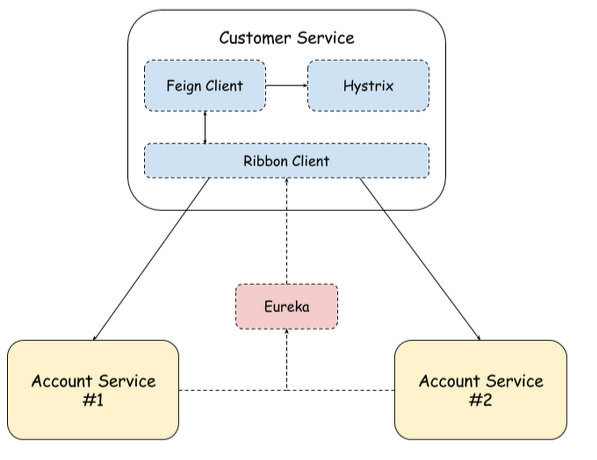
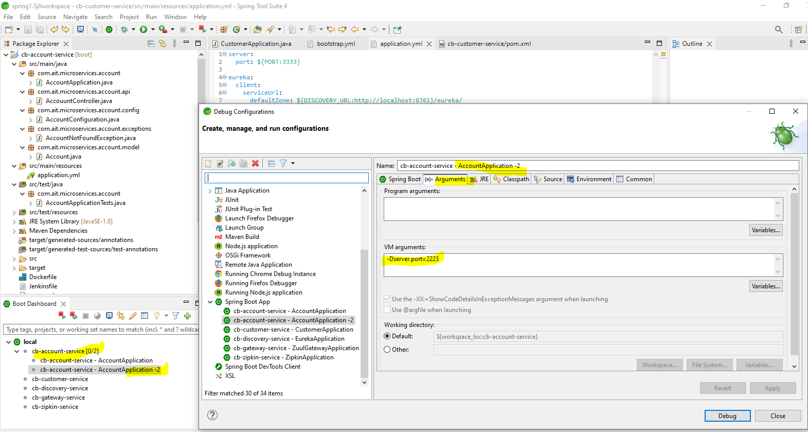
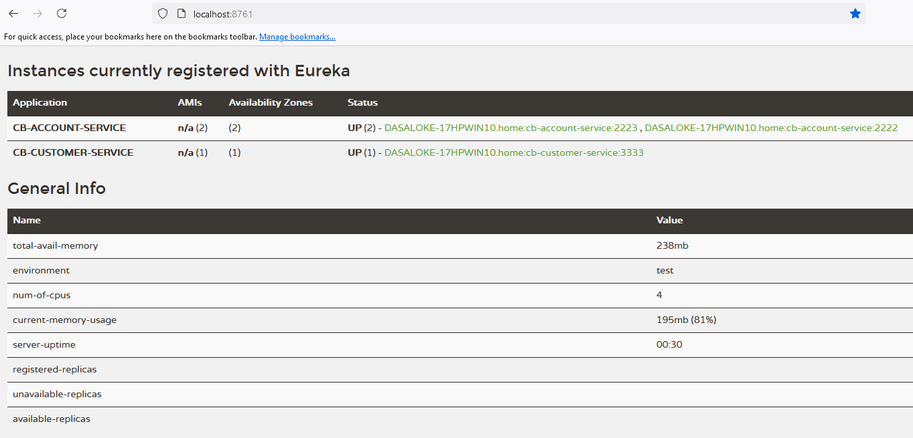
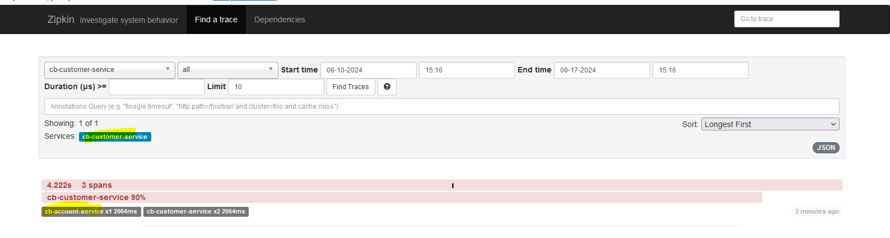
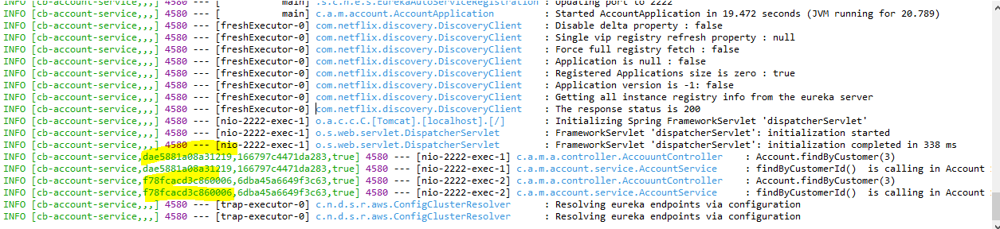

<table style="width:100%">
  <tr>
    <td><h1 align="center">Demo microserice API with gateway(zuul), eureka (discovery), Feign Client (Customer Service), Account Service with Circuit Brekar (Hystrix)</h3></td>
    <td></td>
  </tr>
</table>

[](https://www.oracle.com/ca-en/java/technologies/javase/javase8-archive-downloads.html)
[](https://mvnrepository.com/artifact/org.springframework.cloud/spring-cloud-starter-netflix-eureka-server)
[](https://github.com/alokebd/spring2.7j8-euraka-ribbon-hystrix/tree/main)
[](https://github.com/Netflix/Hystrix/wiki/Configuration)

## About Project:
- Sample (DEMO) micro-service architecture with gatway(zuul), naming service (eureka), declarative web service client (spring feign)  , circuit-breaker(hystirx). In this architecture, spring boot 1.5.4, java 1.8 with spring cloud version (Dalston.RELEASE) have been used.
- 
- Descrption:  Using Fallback and Circuit Breaker, the Customer Service, which calls the API method from Account Service. There two running instances of Account Service. The requests to Account Service instances are load balanced by Ribbon client 50/50.
    
## Used Resources:
- Dependencies:
- Spring Boot (1.5)
- Cloud (Dalston.RELEASE)
- Maven 
- Java (1.8)
- Libraries:
  * Netflix Eureka naming server 
  * Netflix Zuul Gateway (spring-cloud-starter-netflix-zuul)
  * Feign (spring-cloud-starter-openfeign)
  * Ribbon Loadbalancer (with Eureka)
  * Zipkin/Sleuth 
  * Hystrix/Hystrix Dashboard

## Repository contains:

* (1) Load balancing application [cb-discovery-server]
* (2) API gateway application [cb-gateway-server]
* (3) Client application [cb-customer-service]
* (4) Server application [cb-account-server]
* (5) Zipkin Server [cb-zipkin-server]

## Steps to run applications:

* (1) Run Load balancing application first (service discovery). 
* (2) Run the API gateway application (zuul gateway).
* (3) Then run Client application (Customer service - Ribbon Client-Feing Client-Hystrix). 
* (4) At last run Server application (2 instances)

- Check the discovery Eureka server (http://localhost:8761/) where initially following 3 serverices will be registerd.
* CB-ACCOUNT-SERVICE
* CB-CUSTOMER-SERVICE


### Load Balancing Server:

- All client server communication will be done through this load balancing server. 
```
server:  
  port: ${PORT:2222}

spring:  
  application:
    name: cb-account-service
  logging:
    pattern:
      console: "%clr(%d{yyyy-MM-dd HH:mm:ss}){faint} %clr(${LOG_LEVEL_PATTERN:-%5p}) %clr([${springAppName:-},%X{X-B3-TraceId:-},%X{X-B3-SpanId:-},%X{X-Span-Export:-}]){yellow} %clr(${PID:- }){magenta} %clr(---){faint} %clr([%15.15t]){faint} %clr(%-40.40logger{39}){cyan} %clr(:){faint} %m%n${LOG_EXCEPTION_CONVERSION_WORD:-%wEx}"
    level:
      org.springframework: WARN
      org.hibernate: WARN

eureka:  
  client:
    serviceUrl:
      defaultZone: ${DISCOVERY_URL:http://localhost:8761}/eureka/
  instance:
    leaseRenewalIntervalInSeconds: 1
    leaseExpirationDurationInSeconds: 2
      
ribbon:
  eureka:
    enabled: true
```

#### Run Server application instance in two ports
<h3>In IDE (STS) </h3>
<p>  
  Right click on the lb-micro-service-server project -> click properties -> select Run/Debug Setting -> Select existing one (cb-account-service) and click duplicate, then edit it <b>-Dserver. port=2223</b> in the Vm Arguments as shown in the following images. 
</p>
<p align="center">
  
</p>
</p>
  Then select the new configuration and run. Now these two instances of server will be appear in the eureka server dashboard. 
</p>

### Eureka Dashboard
<h3>Eureka</h3>
<p align="center">
  
</p>
  The cb-account-server is having 2 instances (2222 and 2223).
</p>

### Client Application

* This application will perform as consumer of APIs which is written in the main server. 
* It consumes the APIs from the both main server instance based on availability through load balancer. 
* The <b>netflix-eureka-client</b> library is to communicate with load balancer application. 

#### Feign

* We are using Feign to consume APIs rather than using traditional HTTP libraries. 
* Feign will act as a proxy in between server and client. 

### Hystrix Dashboard
- Hystrix Dashboard on the account-service main class, call http://localhost:2222/hystrix.
- Hystrix’s stream from customer-service, add this url `http://localhost:3333/actuator/hystrix.stream` and click Monitor button.
- 

### Run Zipkin Server 
- http://localhost:9411/
- Notes:
* Sleuth logs are printed in the following format: [application-name,traceid,spanid,zipkin-export].
* Where -
* Application-name = Name of the application
* Traceid = each request and response traceid is same when calling same service or one service to another service.
* Spanid = Span Id is printed along with Trace Id. Span Id is different every request and response calling one service to another service.
* Zipkin-export = By default it is false. If it is true, logs will be exported to the Zipkin server.

- 

- 

## Test
* Now we can See totally 2 applications instances are running in eureka server dashboard.
* Call client application API. 
* Import Postman collection (supplied in the root project directory) to test the demo applications.

- NOTE: Load balancer and Hystrix 
- Call http://localhost:3333/customers/{customerId} multiple times where RoundRobin load balancing vs fallback (Hystirx) circuit-breaker chance is 50/50. 

